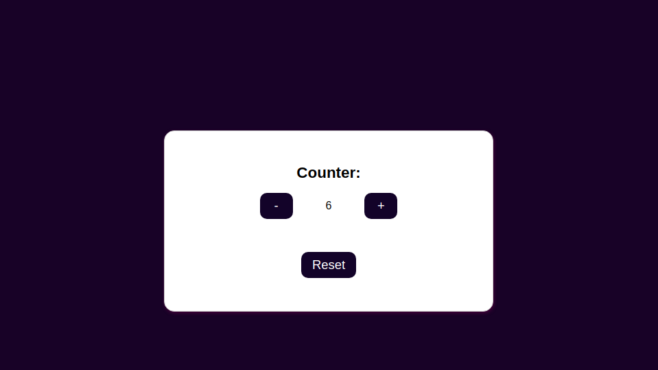

# Counter
# Descrição do Projeto
<p align="center">
Aplicação desenvolvida durante a a primeira fase da B8one Academy.
</p>

<h1 align="center">
  
</h1>


### 🎲 Rodando a Aplicação

```bash
# Clone este repositório
$ git clone <git@github.com:rosana-moreira/Counter.git/>

# Acesse a pasta do projeto no terminal/cmd
$ cd Counter

# Abra o arquivo index.html pelo o navegador
$ index.html


```
